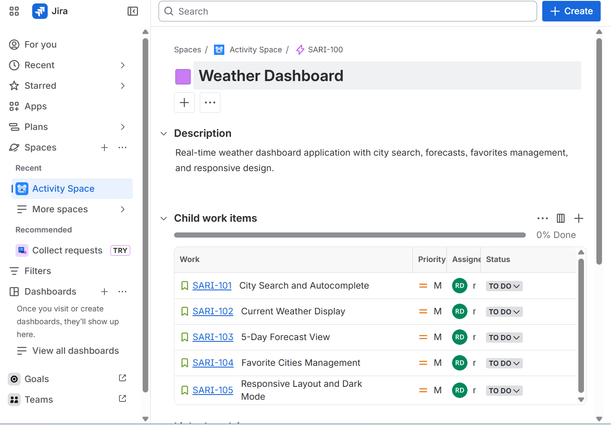
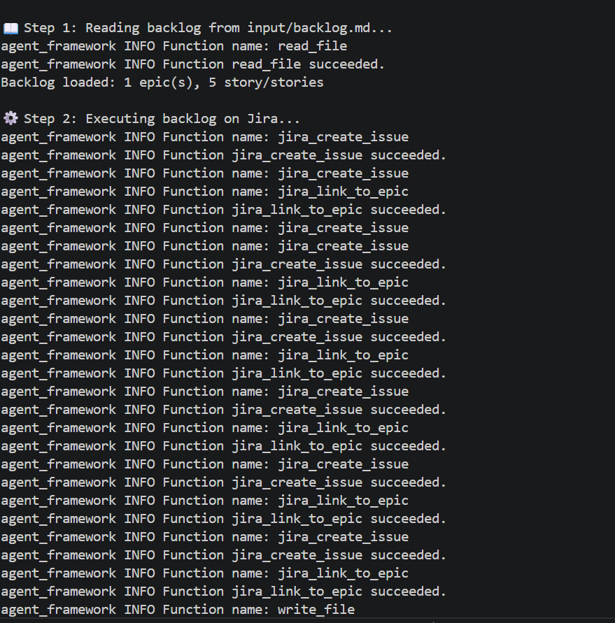
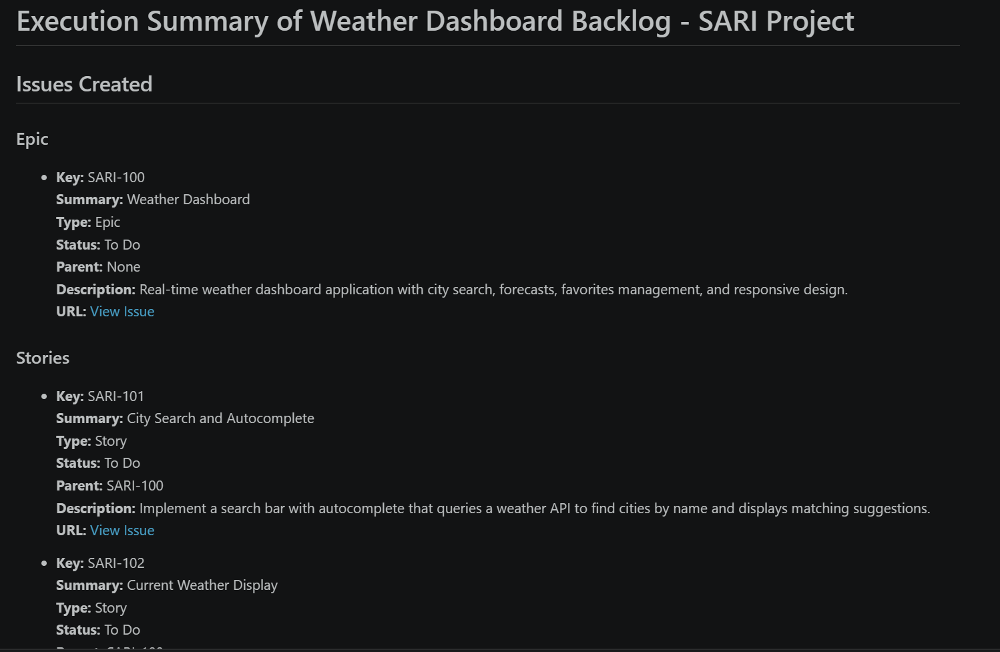

# Pipeline: Backlog → Jira

Read a Markdown backlog, parse it into structured Epics and Stories, and provision them automatically on Jira Cloud via MCP.

---

## Overview

Two specialized agents collaborate sequentially:

1. **BacklogReaderAgent** — reads a `.md` backlog file, parses the structure, and outputs a validated JSON summary (via Pydantic `BacklogOutput`).
2. **JiraExecutorAgent** — receives the parsed backlog, creates Epics and Stories on Jira one at a time via MCP (`mcp-atlassian`), and writes an execution report.

The pipeline is fully automated: point it at a Markdown backlog and it provisions your Jira board in seconds.

---

## Entry Points

| # | Entry Point | What it demonstrates |
|:---:|---|---|
| 1 | `main.py` | **Hello world**: single agent, no tools |
| 2 | `main_mcp_jira.py` | **Single agent + MCP**: interactive Jira commands (OpenAI) |
| 3 | `main_mcp_jira_lf.py` | **Single agent + MCP**: Foundry Local experiment (see [note below](#note-foundry-local-experiment)) |
| 4 | `main_backlog_from_md.py` | **Two-agent pipeline (monolithic)**: reader + executor in one file |
| 5 | `main_backlog_from_md_std.py` | **Two-agent pipeline (modular)**: refactored into `afw_core/` structure |

Each step builds on the previous one, serving as a progressive tutorial.

---

## Screenshots

| Jira Board | Console Output | Execution Report |
|:---:|:---:|:---:|
|  |  |  |

---

## Components

```
afw_core/
├── agents/
│   ├── backlog_reader.py       # BacklogReaderAgent
│   └── jira_executor.py        # JiraExecutorAgent
├── tools/
│   ├── file_reader.py          # Read files from input/
│   └── file_writer.py          # Write timestamped reports to output/
├── mcps/
│   └── jira.py                 # Jira Cloud via mcp-atlassian
├── llms/
│   └── openai.py               # OpenAI provider
└── models/
    └── backlog.py              # BacklogOutput schema
```

---

## Prerequisites

In addition to the [common prerequisites](README.md#prerequisites):

- **Jira Cloud** instance with an API token
  1. Go to https://id.atlassian.com/manage-profile/security/api-tokens
  2. Click **Create API token** and copy the generated value
  3. Note your Jira instance URL and the email associated with your account

`.env` variables:

```env
JIRA_URL=https://your-domain.atlassian.net
JIRA_USERNAME=your-email@example.com
JIRA_API_TOKEN=your-jira-api-token
TOOLSETS=all
```

---

## Usage

### Modular pipeline (recommended)

```bash
pipenv run python main_backlog_from_md_std.py
```

This will:
1. Read `input/backlog.md` via the BacklogReaderAgent
2. Validate the parsed output with Pydantic (`BacklogOutput`)
3. Create all Epics and Stories on Jira via the JiraExecutorAgent
4. Write an execution report to `output/report_<timestamp>.md`

### Monolithic version

```bash
pipenv run python main_backlog_from_md.py
```

Same pipeline, all components defined in a single file.

### Interactive single-agent demo

```bash
pipenv run python main_mcp_jira.py
```

Type Jira commands directly in the console.

---

## Customization

### Add a new backlog

Create a Markdown file in `input/` following this structure:

```markdown
# Project Name - Backlog

## Epic: Epic Title
- Type: Epic
- Description: Epic description text.

### Stories

- **Story 1: Story Title**
  - Type: Story
  - Description: Story description text.
```

Then update the `backlog_file` variable in `main_backlog_from_md_std.py`.

### Add a new MCP server

Create a new file in `afw_core/mcps/` (e.g. `github.py`) with a `create_proxy()` factory function following the same pattern used in `jira.py`.

### Add a new agent

Create a new file in `afw_core/agents/` with a `create_agent(client, options, tools)` factory function following the same pattern used in `backlog_reader.py`.

---

## Note: Foundry Local Experiment

`main_mcp_jira_lf.py` is an experimental variant that uses **Foundry Local** (`FoundryLocalClient`) with a local model (`qwen2.5-7b`) instead of OpenAI. The results were not satisfactory — no local model tested so far handles function calling (tool use) reliably enough for MCP-based workflows. Calls are often malformed, parameters are missing, or the model ignores tool schemas entirely.

It remains unclear whether this is a limitation of the current Foundry Local toolkit maturity or a gap in my understanding of how to configure local models for tool calling. This is an area I plan to revisit and study further.
